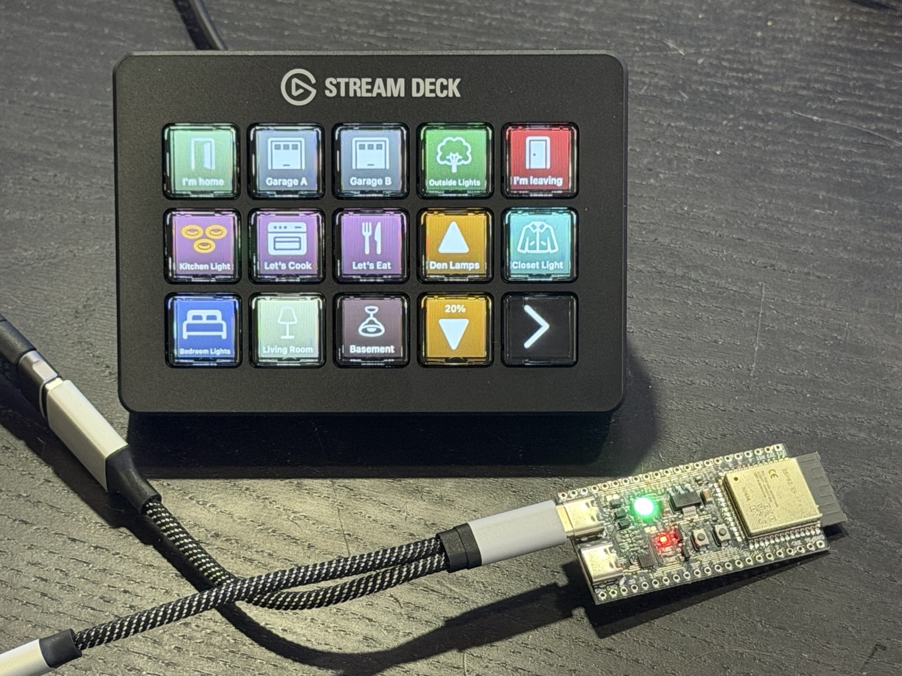
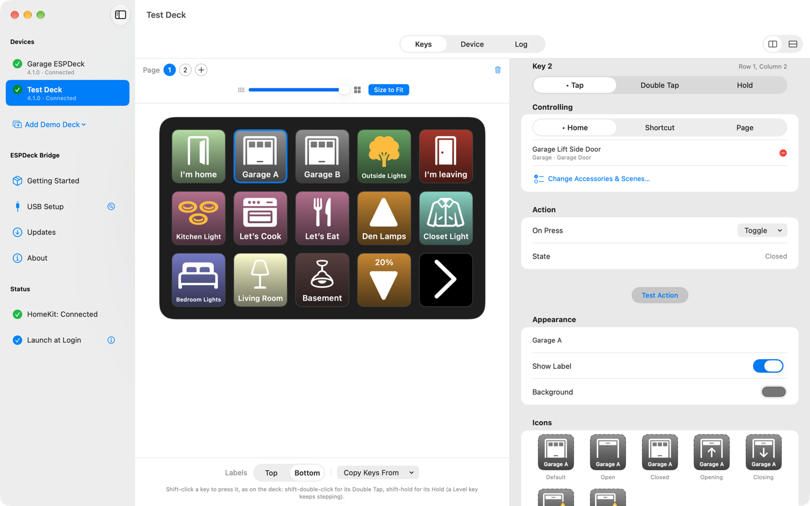
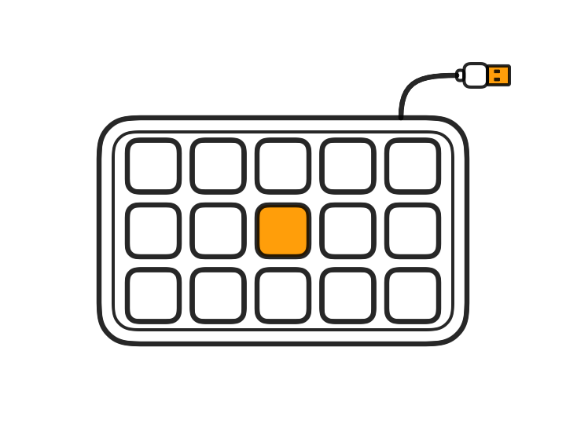
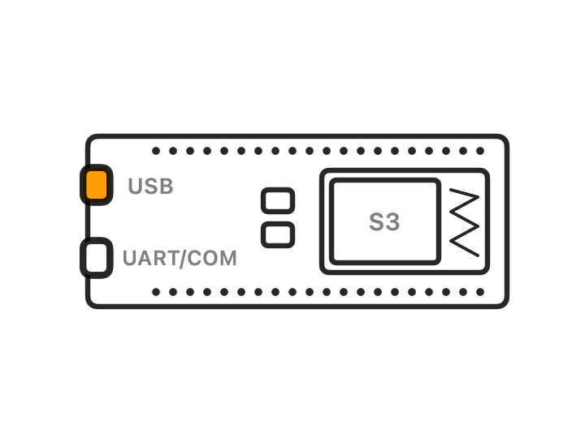
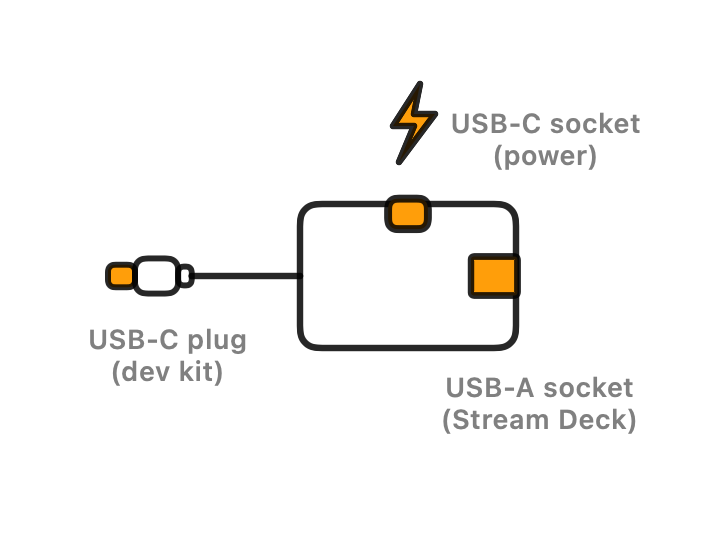
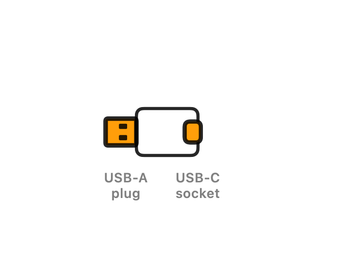
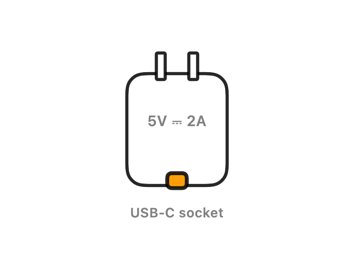
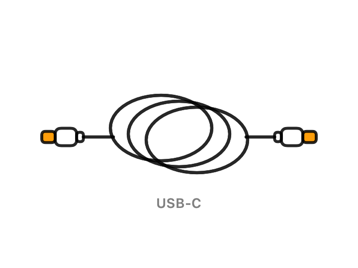

# ESPDeck

 A Stream Deck MK.2 running from an ESP32-S3 dev kit. The green light means it's connected to ESPDeck Bridge.

Turn an [Elgato Stream Deck](https://www.elgato.com/stream-deck) into a HomeKit control panel you can put anywhere in the house, away from your computer. An ESP32-S3 dev kit plugs into the Stream Deck in a computer's place and connects over Wi-Fi to **ESPDeck Bridge**, an app on a Mac elsewhere on your network.

You still need that Mac: it stays on, watches your Home, and triggers actions when keys are pressed. The dev kit only carries key presses and pictures between the Stream Deck and the Mac.

 A Stream Deck Mini under a garage shelf, in a <a href="https://makerworld.com/en/models/1651352-stream-deck-mini-under-desk-slide-out-mount#profileId-1745884">3D-printed slide-out mount</a>.

- **Keys that show what's happening.** A key shows its accessory's state (on or off, open, opening, closed, locked) with the icon, label and color you choose for each state, and follows changes made anywhere else.
- **Accessories, scenes and Shortcuts.** A key toggles an accessory or a group of them, runs a scene, or runs one of your Shortcuts.
- **Tap, double tap and hold.** Each can do something different on the same key.
- **Brightness and fan speed.** A pair of keys steps a light's brightness or a fan's speed up and down; holding repeats.
- **Pages.** A deck has as many pages of keys as you like.
- **Supports every Stream Deck with keys.** Mini, Original, MK.2, XL, Neo, +, Pedal and the modules, each in its own layout; several decks can share one Mac. Only the keys are used, not dials, touch strips or second screens.
- **Sleep and wake.** The deck's screen sleeps on a timer or when a HomeKit accessory changes (a door locks, a light goes off), and can run a scene or a shortcut as it sleeps and wakes.
- **Set up from the Mac.** The app installs the firmware over USB, joins the dev kit to Wi-Fi and names it; firmware updates then arrive over Wi-Fi.
- **Paired and private.** A deck only obeys the Mac it's paired with, over an authenticated connection on your own network. There's no account and no cloud service; the secrets a deck stores can be encrypted on its chip.
- **Try it without hardware.** A demo deck lays out keys and tests their actions before anything is built.

## Documentation

- **[Setting up a deck](docs/setup.md)**: installing the firmware, setup mode, pairing, and encrypting what the deck stores.
- **[The Mac app](docs/mac-app.md)**: building and running ESPDeck Bridge, its pages and menus, Shortcuts, updates, and moving to another Mac.
- **[FAQ](docs/faq.md)**: which Stream Decks work, why it's a Catalyst app, what to check when Shortcuts fail or a deck won't connect.
- **[Development](docs/development.md)**: firmware releases and their signing, uploading from PlatformIO, the tests, and notes on the hardware.
- **[PROTOCOL.md](PROTOCOL.md)**: the wire format both sides implement.

## Getting started

 How the parts connect. The same drawings are in the app's Getting Started page.

1. Gather the parts under Requirements, below. ESPDeck Bridge's **Getting Started** page lists them too and walks through each step.
2. Build and run ESPDeck Bridge on the Mac ([The Mac app](docs/mac-app.md)).
3. Plug the dev kit's **USB** port into the Mac and open **USB Setup**: it installs the firmware, joins the dev kit to Wi-Fi and names it ([Setting up a deck](docs/setup.md)). Without the Mac app, the [web installer](https://jangellx.github.io/ESPDeck/) does the same from a browser.
4. Unplug the dev kit, and connect it to the Stream Deck and power through the OTG adapter.
5. Pair it when it appears under **New Devices**, then give its keys something to do.

## In this repository

- **ESPDeck Bridge/**: Mac Catalyst app (Xcode). HomeKit observation and control, key assignments, rendering, WebSocket server.
- **ESPDeck Device/**: ESP32-S3 firmware (PlatformIO, ESP-IDF 5.5 + Arduino 3.3 as a component).
- **docs/**: the pages listed under Documentation.
- **PROTOCOL.md**: the wire format both sides implement.
- **web/**: the browser installer (ESP Web Tools), published with GitHub Pages; see `web/README.md`.

## Requirements

 Everything for one ESPDeck: the Stream Deck, the OTG adapter with its power cable and the USB-A adapter for the deck's cable, and the dev kit.

<table>
<tr><td align="center"> 1. Stream Deck</td><td align="center"> 2. ESP32-S3 dev kit</td><td align="center"> 3. USB-C OTG adapter</td></tr>
<tr><td align="center"> 4. USB-A to USB-C adapter</td><td align="center"> 5. 5 V power supply</td><td align="center"> 6. USB-C cable</td></tr>
</table>

- A Mac on **macOS 14 (Sonoma) or later**, signed in to an iCloud account that's a **member of the Home**. It has to **stay on and logged in**; for an always-on deck, turn on automatic login and the app's **Launch at Login**.
- An **ESP32-S3 dev kit with 16 MB flash and 8 MB PSRAM** (ESP32-S3-DevKitC-1 **N16R8**) running ESPDeck firmware.
- An **Elgato Stream Deck** (Mini, Original, MK.2, XL, Neo, +, Pedal, or a module).
- A **5 V USB-C power supply rated 2 A or more**. Through the OTG adapter, it powers both the ESP32-S3 and the Stream Deck.
- A **passive USB-C OTG adapter with a power input**: a USB-C plug for the board's native **USB** port, a USB-A port for the Stream Deck, and a USB-C port for the power supply. It must be passive; adapters that need USB-PD negotiation may never switch on power to the Stream Deck.
- If the Stream Deck's cable ends in USB-C: a **USB-A (male) to USB-C (female) adapter** that includes the CC pull-up resistor, so the Stream Deck sees a power source. Choose one labeled for **charging and data** (sometimes "sync"), not charge-only; one whose listing mentions a **56 kΩ resistor** is the surest bet. To check an adapter before building, plug the Stream Deck through it into a Mac: if the deck lights up and appears in System Information → USB, it will work. If the deck's cable already ends in USB-A, you don't need this adapter.
- A **USB-C cable that carries data** (not a charge-only one). It connects the power supply to the OTG adapter, and the board's **USB** port to the Mac when installing firmware.
- A **2.4 GHz Wi-Fi network** that the Mac and the ESP32 share.

## Credits

ESPDeck uses or includes the following; [THIRD-PARTY-NOTICES.md](THIRD-PARTY-NOTICES.md) has the full notices and license details.

- [python-elgato-streamdeck](https://github.com/abcminiuser/python-elgato-streamdeck) by Dean Camera (MIT license): the Stream Deck model layouts and USB report formats in the firmware are derived from it.
- [Elgato's Stream Deck HID documentation](https://docs.elgato.com/streamdeck/hid/).
- [ESP-IDF](https://github.com/espressif/esp-idf) (Apache 2.0) and the [Arduino core for ESP32](https://github.com/espressif/arduino-esp32) (LGPL 2.1).
- Espressif components: the [USB Host HID driver](https://github.com/espressif/esp-usb), [esp_websocket_client and mdns](https://github.com/espressif/esp-protocols), the [QR Code component](https://github.com/espressif/idf-extra-components) (all Apache 2.0), and [esp_new_jpeg](https://github.com/espressif/esp-adf-libs) (Espressif MIT).
- [esp_littlefs](https://github.com/joltwallet/esp_littlefs) by Brian Pugh (MIT).
- [Inter](https://github.com/rsms/inter) by Rasmus Andersson (SIL Open Font License 1.1): the typeface for text the firmware draws on keys, rendered into `src/Font.h` by `tools/make_font.swift`.
- [ESP Web Tools](https://github.com/esphome/esp-web-tools) (Apache 2.0): the browser installer.

The app's About page lists the same credits and shows the full license text where the license requires it. Keep the two in sync (`ESPDeck Bridge/UI/AboutView.swift`).

Elgato and Stream Deck are trademarks of Corsair Memory, Inc. HomeKit and Mac are trademarks of Apple Inc. ESPDeck isn't affiliated with, endorsed by, or sponsored by Elgato, Corsair, Apple, or Espressif.

## License

ESPDeck is released under the [MIT License](LICENSE). The firmware and the web installer include other people's work under their own licenses; see Credits above and [THIRD-PARTY-NOTICES.md](THIRD-PARTY-NOTICES.md).
