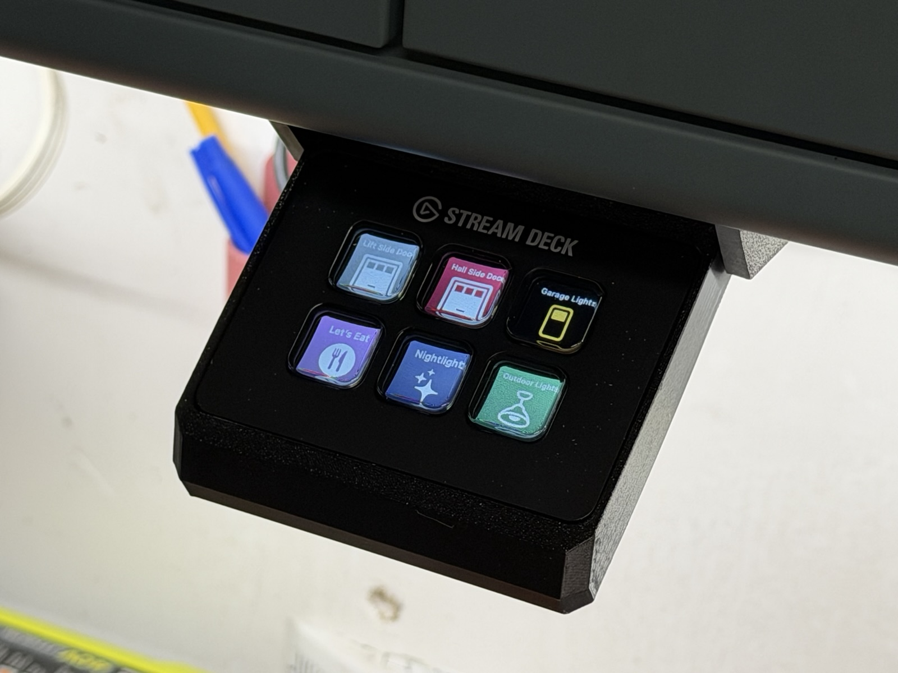
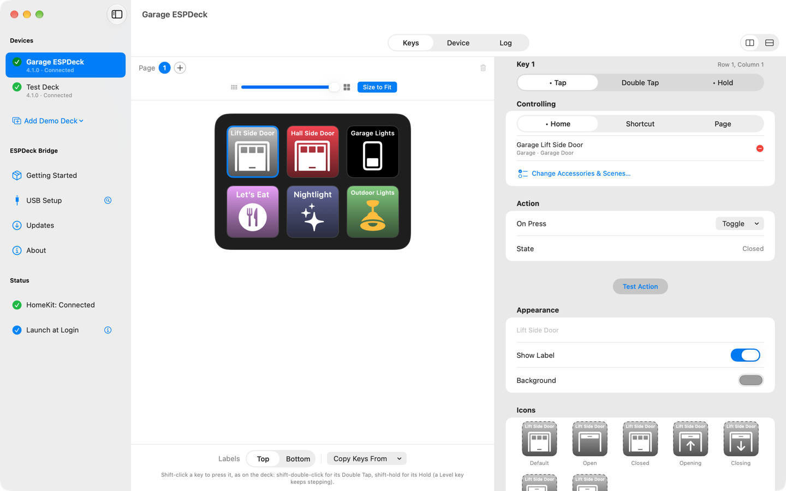

# FAQ

[Overview](../README.md) · [Setting up a deck](setup.md) · [The Mac app](mac-app.md) · [FAQ](faq.md) · [Development](development.md)

## What it needs

### Which Stream Decks are supported?

Every [Elgato Stream Deck](https://www.elgato.com/stream-deck) with keys. The firmware knows each of these and reports its layout to the Mac:

| Model | Keys |
|---|---|
| Stream Deck Mini (the original, the 2022 one and the Discord one), 6-Key Module | 2 × 3 |
| Stream Deck (Original and Original V2), MK.2, MK.2 Scissor, 15-Key Module | 3 × 5 |
| Stream Deck XL, XL V2, 32-Key Module | 4 × 8 |
| Stream Deck Neo | 2 × 4 |
| Stream Deck + | 2 × 4 |
| Stream Deck Pedal | 3 pedals, no screen |


<br><sub>A Stream Deck Mini under a garage shelf, in a <a href="https://makerworld.com/en/models/1651352-stream-deck-mini-under-desk-slide-out-mount#profileId-1745884">3D-printed slide-out mount</a>.</sub>



- **Tested on real hardware:** the Mini and the MK.2 Scissor. The others follow the same USB protocols (taken from [python-elgato-streamdeck](https://github.com/abcminiuser/python-elgato-streamdeck)) but haven't been tried. If the pictures come out sideways or mirrored on yours, change **Image Orientation** on the deck's Device page.
- **Only the keys are used.** The +'s dials and touch strip and the Neo's two touch keys do nothing. The Neo's info bar and the +'s strip show the deck's name.
- **The Pedal** has no screen: its pedals work as three keys, and the dev kit's status light stands in for the display while pairing.

### Does the Mac have to stay on?

Yes. The Stream Deck no longer needs a computer next to it, but ESPDeck Bridge on the Mac is what talks to HomeKit and decides what every key shows and does. The Mac has to be on, awake and logged in to an account that's a member of the Home; turn on automatic login and the app's **Launch at Login** for a deck that's always ready. While the Mac is away, the deck reads "Connecting to Mac".

### Can I use an iPhone, an iPad, a Windows PC or a Raspberry Pi as the bridge?

No. ESPDeck Bridge is a Mac app only.

### Which ESP32 board do I need?

An ESP32-S3 dev kit with 16 MB of flash and 8 MB of PSRAM, sold as **N16R8** (Espressif's ESP32-S3-DevKitC-1, or one of the many clones). USB Setup checks the chip, flash and PSRAM before it installs anything and says so if the board won't do. Other ESP32 chips don't work: the firmware needs the S3's USB host port to drive the Stream Deck.

### Why does it need a 2.4 GHz network?

The ESP32-S3's radio is 2.4 GHz only. The Mac can be on 5 GHz or Ethernet, as long as it's the same network.

### Does it replace Elgato's Stream Deck software?

It doesn't use it. The Stream Deck is plugged into the dev kit instead of a computer, and ESPDeck draws the keys itself. Nothing is installed on the Stream Deck: plug it back into a computer and it works with Elgato's software as before.

## How it's made

### Why is this a Catalyst app?

Because of HomeKit. Apple's HomeKit framework isn't available to ordinary (AppKit) Mac apps; on the Mac, only a Mac Catalyst app can use it. So the app is Catalyst, and the things Catalyst can't do live in a small AppKit bundle inside it: the menu bar item, running Shortcuts, and the serial port work in USB Setup.

### Does anything leave my network?

No. The deck and the Mac talk to each other directly over your Wi-Fi, and the Mac talks to HomeKit. There's no account and no ESPDeck server. The only internet use is the app looking on GitHub for firmware releases and downloading them; under **Updates** you can have it look only when you click Check Now.

### What stops someone else on my Wi-Fi from pressing my keys?

Pairing. A deck and its Mac share a key, agreed when you confirm the code on the deck, and every message between them is authenticated with it. A deck ignores every other Mac, and the Mac ignores decks it hasn't paired with. See [Pairing](setup.md#pairing).

### Should I encrypt the deck's stored secrets?

The dev kit keeps three secrets in its flash memory: your Wi-Fi password, the pairing key it shares with your Mac, and the developer password if you use one. Stored plainly, anyone who takes the dev kit can read them off it over USB. Encrypting stores them under a key that's burned into the chip itself, where no software can read it, so the flash alone gives nothing away.

It's permanent for that board: the key can't be removed, so the board always encrypts what it stores from then on. Everything else stays as it was. The Wi-Fi network, name and pairing can still be changed, updates and factory reset still work, and the board can still be reflashed for something other than ESPDeck.

So: yes, unless you have a reason to read the board's flash yourself. New devices encrypt by default at first setup, and a deck set up earlier can be switched from its Device page. See [Encrypting stored secrets](setup.md#encrypting-stored-secrets).

### Why can't I just download a .dmg from here?

Because of HomeKit again. Apple only lets an app use HomeKit when it comes from the App Store, or when you build it yourself with your own Apple developer account. An app signed for direct download (a .dmg from a website) can't be given that permission, so it couldn't see your Home at all.

That leaves two ways to get ESPDeck Bridge:

- **The Mac App Store.** ESPDeck Bridge is on its way there; the link will be here once it's available.
- **Build it yourself.** With Xcode and an Apple developer account; see the next question.

The firmware is different: it's a plain download. Releases are on this repository's Releases page, and the [web installer](https://jangellx.github.io/ESPDeck/) installs the latest one from a browser.

### Can I build it myself and never go near the App Store?

Yes. Nothing has to be submitted to Apple or reviewed: a build you make in Xcode runs on your own Mac, signed with your own developer account. Plenty of people would rather build a thing than download it, and the whole project is here for that.

For the app:

1. Install Xcode and sign in to it with your Apple account (Xcode ▸ Settings ▸ Accounts).
2. Clone this repository.
3. Create `ESPDeck Bridge/Config/Signing.local.xcconfig` with your own team and a bundle ID prefix of your own:
   ```
   DEVELOPMENT_TEAM = ABCDE12345
   BUNDLE_ID_PREFIX = com.example
   ```
   The file is git-ignored, so pulling updates won't touch it.
4. Open `ESPDeck Bridge/ESPDeck Bridge.xcodeproj`, choose the **My Mac (Mac Catalyst)** destination, and run. Xcode registers the app ID and its HomeKit capability for you.

Things to know:

- **Step 3 is what lets your build use HomeKit.** The app has to be signed by your own account, under a bundle ID of your own, for Xcode to add the HomeKit capability to it. It does that by itself when it signs the app; if something is missing, the signing error says what.
- **A development build stops working when its signing expires** (about a week with a free account, a year with a paid one). Build and run again to renew it; your decks, keys and pairings are kept.
- **Updating is `git pull` and run again.**

The firmware is yours to build too: `pio run -t upload` in `ESPDeck Device`, with PlatformIO. One thing differs from the app's own installer: ESPDeck Bridge's **Updates** page only installs releases signed by this project, so put your own builds on with **Install Firmware from File…**, USB Setup's **Choose File…**, or PlatformIO. See [Development](development.md).

## When something doesn't work

### Why do my Shortcuts fail?

The deck's Log page, and the warning triangle on the key, say when a shortcut failed; the Log gives the reason. The usual ones:

- **ESPDeck Bridge isn't allowed to control Shortcuts.** macOS asks the first time the app lists or runs a shortcut. If you declined, turn it on in System Settings → Privacy & Security → Automation, under ESPDeck Bridge.
- **The shortcut was renamed or deleted.** The key remembers the shortcut it was given; choose it again in the key's settings.
- **It's still running.** Shortcuts run one at a time, and pressing a key again while its shortcut is still going doesn't start it a second time.
- **It needs you.** Shortcuts run in the background on the Mac, through Shortcuts Events. One that asks a question, shows a menu or needs an app in front may wait for someone at the Mac, or fail.
- **It works on your iPhone but not here.** The shortcut runs on the Mac, so it needs actions and apps the Mac has.

Test a shortcut from the key's settings (**Key ▸ Test Action**, ⌘T) to see what the deck would do.

### The deck says "Connecting to Mac" and never connects.

- The Mac is asleep, logged out, or ESPDeck Bridge isn't running.
- The Mac and the deck are on different networks, or on a guest network that keeps devices apart ("client isolation").
- macOS's **Local Network** permission is off for ESPDeck Bridge (System Settings → Privacy & Security → Local Network).
- A firewall on the Mac is blocking incoming connections to ESPDeck Bridge (it listens on port 48620).
- The deck is paired with a different Mac, or this Mac has lost its pairing key. Its page in the app says so and shows how to unpair it.

### My board doesn't show up in USB Setup.

- Use the board's **USB** port, not the one marked UART or COM.
- Use a cable that carries data; many USB-C cables only charge.
- On some clone boards a socket only connects one way up: flip the USB-C plug over and try again.
- If the board runs other firmware, put it in flashing mode: hold **BOOT**, press and release **RST**, release BOOT.

### The Stream Deck stays dark when it's plugged into the dev kit.

It's almost always power. The OTG adapter has to be a passive one with a power input, the supply 5 V and 2 A or more, and a Stream Deck whose cable ends in USB-C needs a USB-A to USB-C adapter with the right resistor in it. The [requirements](../README.md#requirements) have the details and a way to test the adapter on a Mac first.

### The deck went dark after working.

It's asleep: the sleep timer on its Device page ran out, or one of its sleep triggers fired. Press any key to wake it. That first press only wakes the deck; it doesn't run the key.

### I pressed a key and nothing happened.

- A key acts when it's released, not when it goes down.
- A press that's part of pressing several keys at once is ignored, so the two-corner hold for setup mode doesn't set things off.
- If the key runs a shortcut, see the question above.

## Changing things later

### How do I change the deck's Wi-Fi network?

Hold the top-left and bottom-right keys for 5 seconds to enter setup mode and use the setup page, or plug the dev kit into the Mac and use **USB Setup**. See [Setup mode](setup.md#setup-mode).

### How do I move everything to a new Mac?

Export the bridge on the old Mac and import it on the new one; the decks carry on without pairing again. See [Moving to another Mac](mac-app.md#moving-to-another-mac).

### How do I start a deck over?

**Factory Reset Device…** on its Device page, or Factory Reset on the deck's setup page. It erases the dev kit's Wi-Fi settings, name and pairing; its key layout stays in the app and comes back when you pair it again.

### How do I update the firmware?

The **Updates** page offers new releases and installs them over Wi-Fi; it can do so automatically. The app only installs releases signed by this project.
