# The Mac app

[Overview](../README.md) · [Setting up a deck](setup.md) · [The Mac app](mac-app.md) · [FAQ](faq.md) · [Development](development.md)

**On this page**

- [Building and running](#building-and-running)
- [The menu bar](#the-menu-bar)
- [The sidebar](#the-sidebar)
- [The Keys page](#the-keys-page)
- [Setting up a key](#setting-up-a-key)
- [Shortcuts](#shortcuts)
- [The Device page](#the-device-page)
- [The Log page](#the-log-page)
- [Getting Started and USB Setup](#getting-started-and-usb-setup)
- [Updates](#updates)
- [Menus and keyboard shortcuts](#menus-and-keyboard-shortcuts)
- [Moving to another Mac](#moving-to-another-mac)
- [Sandbox and security](#sandbox-and-security)
- [Moving from an unsandboxed build](#moving-from-an-unsandboxed-build)
- [How it's built](#how-its-built)

## Building and running

1. Open `ESPDeck Bridge.xcodeproj`, choose the **My Mac (Mac Catalyst)** destination, and let automatic signing register the App ID. The app ID needs the HomeKit capability.
   - Team, bundle ID prefix, and the GitHub repository used for firmware updates are in `ESPDeck Bridge/Config/Signing.xcconfig`. To build under your own team, create `Config/Signing.local.xcconfig` (git-ignored) and override `DEVELOPMENT_TEAM` and `BUNDLE_ID_PREFIX` there.
2. Run it. It has no Dock icon; use the grid icon in the menu bar and choose **Configure…**, or choose a deck listed at the top of that menu to open its keys. **Launch at Login** is in the same menu, in the app menu, and in the sidebar's Status section.
3. For unattended use: turn on auto-login for an account that's a member of the Home.

## The menu bar

ESPDeck Bridge has no Dock icon while its window is closed. It lives in the menu bar, under the grid icon, and that menu is how you open everything else.

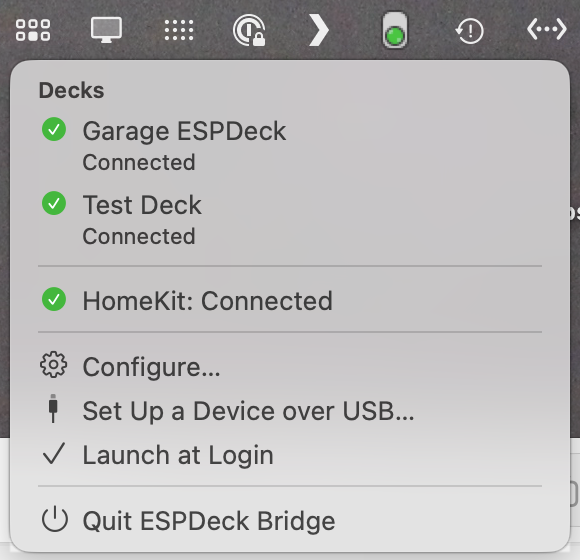

- The status lines at the top say whether the bridge is waiting for a deck, whether HomeKit is connected, and whether anything needs attention.
- Each deck is listed with its state. Choosing one opens its Keys page.
- **Configure…** opens the configuration window.
- **Set Up a Device over USB…** opens the window on USB Setup.
- **Launch at Login** and **Quit ESPDeck Bridge** are at the bottom.

The arrow keys move through the menu while the app is in front.

## The sidebar

The configuration window's sidebar has three sections: your decks, the app's own pages, and the bridge's status. Choosing a deck shows its three pages, **Keys**, **Device** and **Log**, which are picked at the top of the window (⌘1 to ⌘3).

### Devices

This section lists every deck this Mac knows about, and the ones waiting to be added. It's where you choose which deck to work on.

- Each deck is listed by name, with its state under it (connected, asleep, waiting to be paired, and so on). Decks are told apart by their MAC address, so renaming one doesn't confuse them.
- **Not Connected** lists the decks that aren't connected now. That list can be hidden.
- **New Devices** lists the decks on the network that haven't been paired yet. Choose one to pair it (see [Pairing](setup.md#pairing)).
- **Add Demo Deck** makes a deck with no hardware, in the model you pick. You can lay out its keys, test their actions, and copy them to a real deck later.

### ESPDeck Bridge

This section holds the pages that belong to the app and not to any one deck. They cover getting a deck built, set up and kept up to date.

- **Getting Started** has the parts list and the setup steps. The window opens here while there are no decks.
- **USB Setup** installs firmware on a board plugged into the Mac. Its badge counts the boards it has found.
- **Updates** shows firmware releases and installs them.
- **About** has the version, the requirements, exporting and importing the bridge, the license and the acknowledgments.

### Status

This section shows how the bridge itself is doing, at a glance. It's the first place to look when a deck isn't responding.

- The first line says what the bridge is waiting for or connected to.
- The **HomeKit** line says whether the app can reach your Home.
- **Launch at Login** shows whether the app starts when you log in, and turns that on or off.
- A problem that needs attention is shown here too, and comes with a notification.

## The Keys page

The Keys page is where a deck's keys are laid out. It shows a preview of the deck and, for the key you select, everything that key shows and does.

### The preview

The preview is a simulated deck in the device's own layout. It shows what each key shows right now, and it's where you select, move and try out keys.

- Click a key to select it. The arrow keys move the selection after a click in the preview.
- Shift-click a key to press it as on the deck. Shift-double-click does its Double Tap, and holding with Shift does its Hold.
- Drag a key onto another to swap them.
- Drop an image on a key to make it the key's icon.
- Drop a color on a key, from the Colors panel or a color well, to make it the key's background.
- Right-click a key for Copy, Paste and Clear.

### Pages

A deck can have several pages of keys, and the page bar above the preview moves between them. The deck itself shows whichever page it's on.

- Click a page number to edit that page, and **+** to add a page.
- Right-click a page number to delete that page.
- Keys with a Page action move the deck from one page to another.

### Size and arrangement

These controls change how the Keys page is laid out, not the deck. They're remembered between launches.

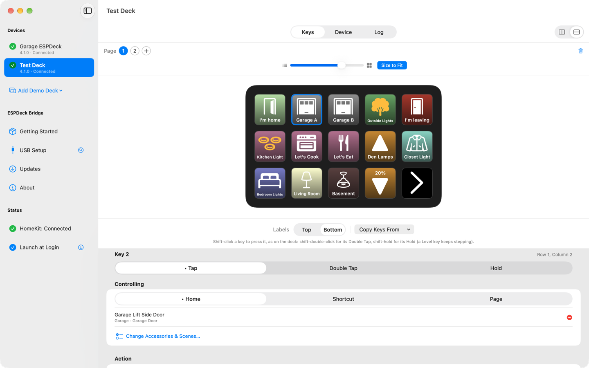

- The slider and **Size to Fit** under the page bar zoom the preview. Pinching on a trackpad does the same, and so do View ▸ Zoom In and Zoom Out.
- The control at the far right of the page bar puts the preview beside the key's settings or above them. Above suits a wide deck.
- Dragging the divider between the preview and the settings resizes them.
- **Labels** under the preview puts every key's label at the top or at the bottom.

## Setting up a key

A key's settings appear when you select it. Work down them in order: which press, what it controls, what the press does, and how the key looks.

### 1. Presses: Tap, Double Tap and Hold

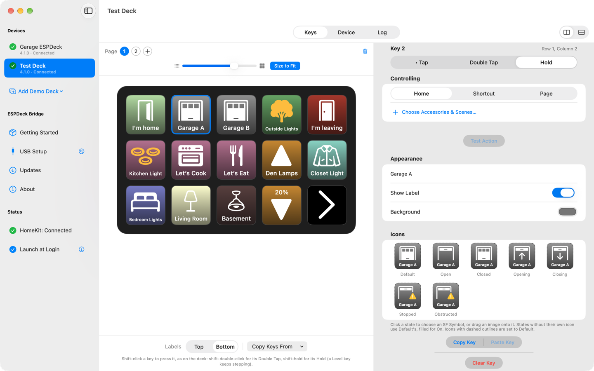

A key can do three different things, one for each kind of press. **Tap**, **Double Tap** and **Hold**, at the top of the settings, choose which one you're setting up. The key's look (its icon, label and color) belongs to its tap.

### 2. What it controls

The **Controlling** section chooses what the press acts on. It has three tabs.

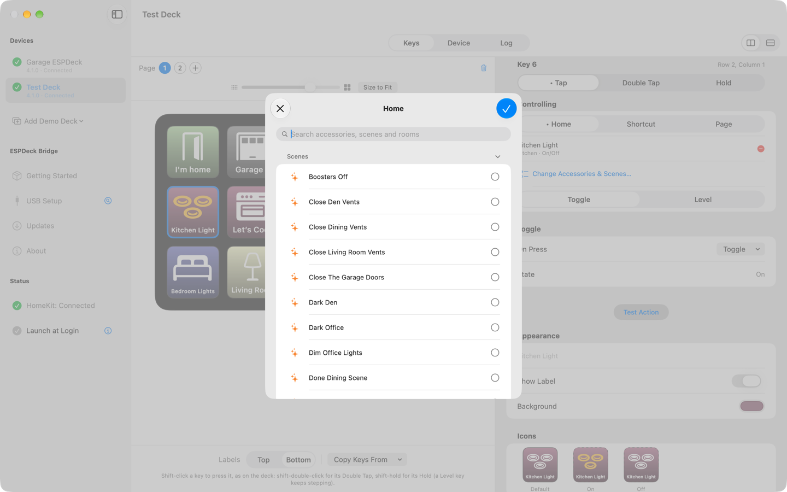

- The **Home** tab has your accessories and scenes, in a sheet arranged by room like the Home app, with a search field.
  - You can pick one accessory, or several to control together. The starred one is the key accessory, and the key shows its state.
  - Scenes can be mixed in with accessories. **Scenes Run** then says when they run: on every press, only when turning on, or only when turning off.
  - With more than one Home, accessories and scenes are grouped by Home, and one key can use several Homes.
- The **Shortcut** tab has your Shortcuts. See [Shortcuts](#shortcuts), below.
- The **Page** tab has the commands that move between pages: Next Page, Previous Page, First Page, Last Page, Go to Page, and Show Page Number.

### 3. What the press does

Once a key has something to control, this section chooses the action. The choices depend on what was picked.

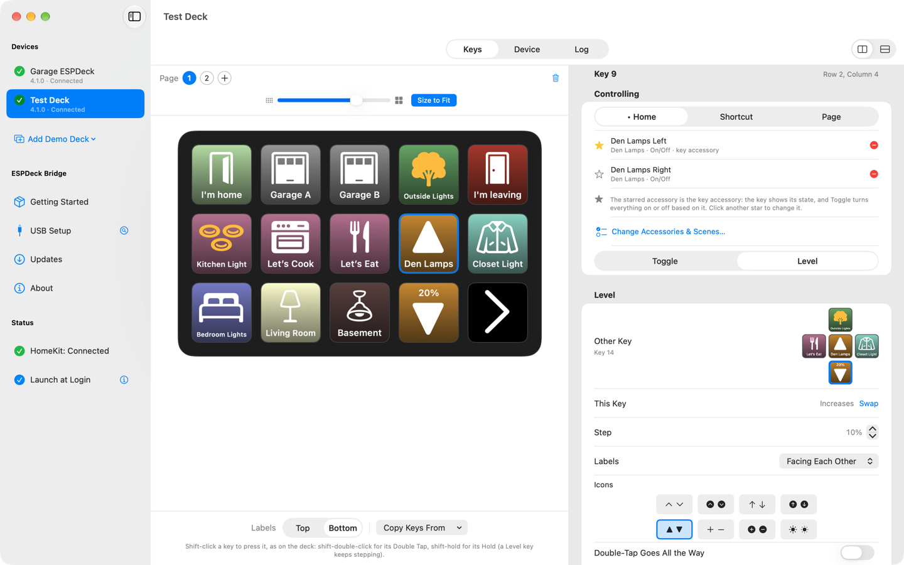

- **On Press** lists the actions that fit: Toggle, Turn On, Turn Off, Open, Close, Lock, Unlock, Run Scene, or Nothing. With Nothing, the key only shows state.
- A light with brightness, or a fan with speeds, can be set to **Toggle** or **Level**. Level makes a pair of keys that step the level up and down.
  - **Other Key** chooses the second key of the pair, and **Swap** exchanges which of the two raises the level.
  - **Step** sets how far each press goes. Holding a key keeps stepping.
  - **Double-Tap Goes All the Way** makes a double tap jump to full, or to off.
  - The two keys share their background color.
- **Test Action** (⌘T) performs the action now, without the deck.

### 4. How it looks

The Appearance and Icons sections set what the key shows. A key can look different in each state of its accessory.

- **Label** sets the key's text, and **Show Label** hides or shows it.
- **Background** sets the key's color.
- **Icons** has one icon for each state the key can show: Default, plus On and Off, or Open, Opening and Closed, and so on. Drop an image on a state, or choose an SF Symbol for it. A state without its own icon uses Default.

**Copy Key**, **Paste Key** and **Clear Key** are at the bottom of the settings, and in the Edit menu.

A key acts when it's released, not when it goes down. A press that's part of pressing several keys at once is ignored, so the two-corner hold for setup mode doesn't set anything off.

## Shortcuts

A key on the **Shortcut** tab runs one of your Shortcuts on the Mac. A shortcut key can be a plain button or a switch with two states.

- **One-Shot** runs the shortcut once per press.
- **On/Off** makes a key with two states. Each press runs the shortcut with "on" or "off" as its Shortcut Input, which is the state the key is switching to. If the shortcut ends with Stop and Output of "on" or "off", the key shows that state instead.
- **Reload Shortcuts** rereads the list after you add or rename a shortcut.

How shortcuts run:

- Shortcuts run through Shortcuts Events, in the background. The app sends the Apple Events itself, without launching any helper tool, and starts Shortcuts Events when it isn't running.
- Shortcuts run one at a time. Pressing a key again while its shortcut is still running doesn't start it again.
- macOS asks to let the app control Shortcuts Events the first time it lists or runs a shortcut. If you declined, turn it on in System Settings → Privacy & Security → Automation, or reset the decision with `tccutil reset AppleEvents com.tmproductions.ESPDeck-Bridge` and ask again.

When a shortcut fails, the key shows a warning triangle and the Log page says why. See [Why do my Shortcuts fail?](faq.md#why-do-my-shortcuts-fail) in the FAQ.

## The Device page

The Device page has everything about the deck itself, as opposed to its keys: its name, its screen, when it sleeps, and its firmware. The destructive and one-time actions are here too.

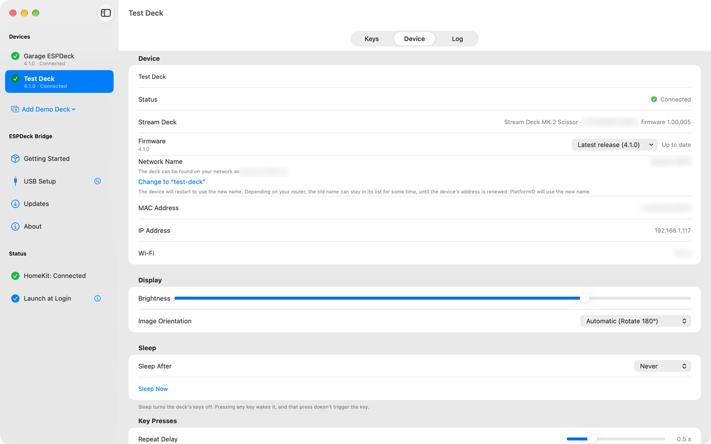

- The **Device** section has the deck's name and its **Network Name**, which is its name on the network for `ping` and PlatformIO. It also shows the deck's status, Stream Deck model, MAC and IP addresses, and the Wi-Fi network it's set up for (firmware 4.1.0 and later).
- The **ESPDeck Firmware** section shows the version the deck runs, and installs an update or a file.
- The **Display** section has **Brightness** and **Image Orientation**.
- The **Sleep** section has **Sleep After** (a timer), **Sleep Now** and **Wake Now**. It also sets a command to run as the deck sleeps and as it wakes: an accessory, a scene or a shortcut.
- The **Triggers** section sleeps or wakes the deck when a HomeKit accessory changes, like a door locking or a light going off.

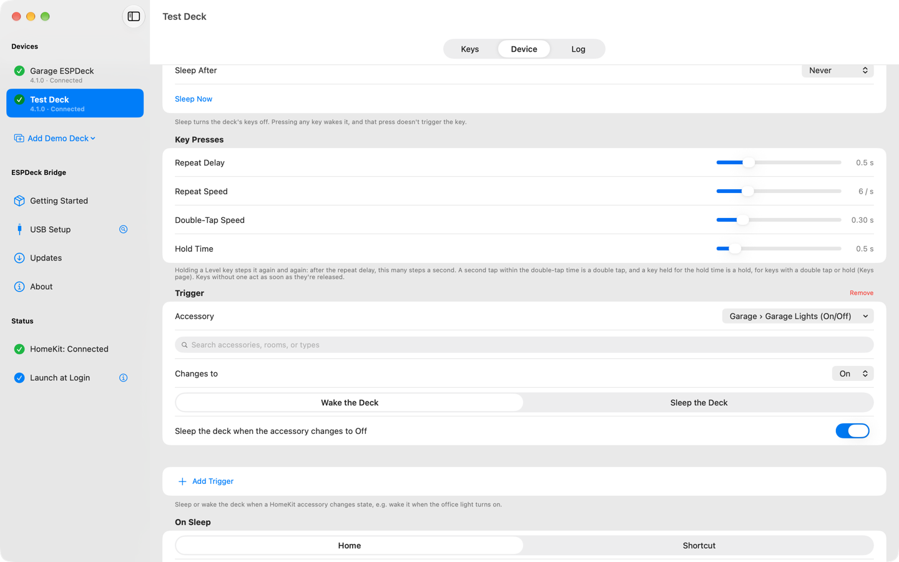

- The **Key Presses** section sets **Double-Tap Speed** and **Hold Time**, which are how long counts as each. **Repeat Delay** and **Repeat Speed** are for keys that repeat while held.
- The **Setup** section has the actions that change the deck as a whole.
  - **Enter Setup Mode** puts the deck in setup mode, to change its Wi-Fi from a phone.
  - **Copy From Deck…** copies another deck's keys and settings to this one.
  - **Clear All Keys…** empties every key on every page.
  - **Factory Reset Device…** erases the device. It can get its own settings, or another deck's, back once it's paired again.
  - **Forget Device…** removes the deck from this Mac and unpairs it.

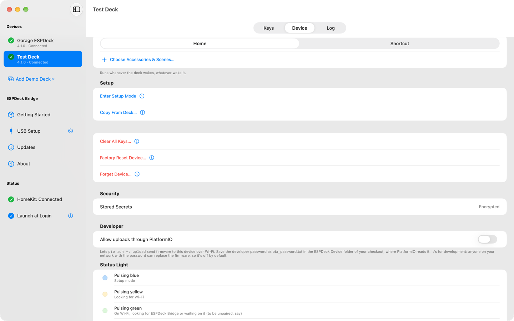

- The **Security** section says whether the deck's stored secrets are encrypted, and has **Encrypt Stored Secrets Now…** (see [Encrypting stored secrets](setup.md#encrypting-stored-secrets)).
- The **Developer** section has **Allow uploads through PlatformIO** and the developer password (see [Development](development.md#firmware-updates-and-releases)).
- The **Status Light** section explains what the colors of the dev kit's light mean. The same list is in [The status light](setup.md#the-status-light).

A demo deck's Device page has only its name and model.

## The Log page

The Log page shows the messages passing between the Mac and the deck as they happen. It's the place to look when a key doesn't do what you expected.

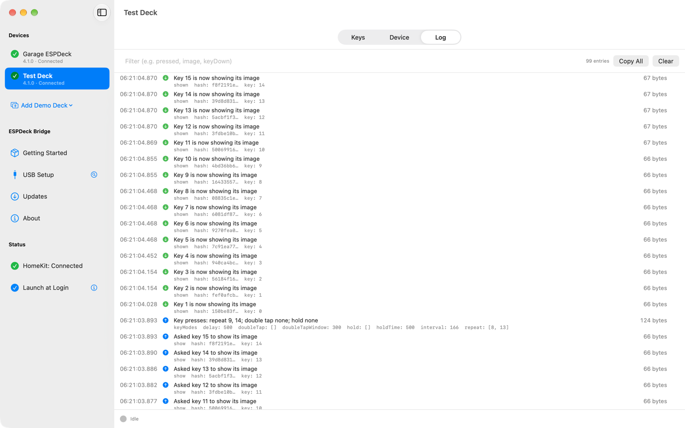

- The newest entry is at the top. Entries cover key presses, images sent, state changes, and the reason when something failed.
- **Filter** narrows the list to entries containing some text, such as "pressed", "image" or "keyDown".
- Click an entry to select it, and use ⌘ or Shift to select several. **Copy Selected** or ⌘C copies them, and **Copy All** copies everything shown.
- **Clear** empties the log.

## Getting Started and USB Setup

These two pages take a new deck from a box of parts to a paired device. Getting Started is the guide, and USB Setup does the work on the board.

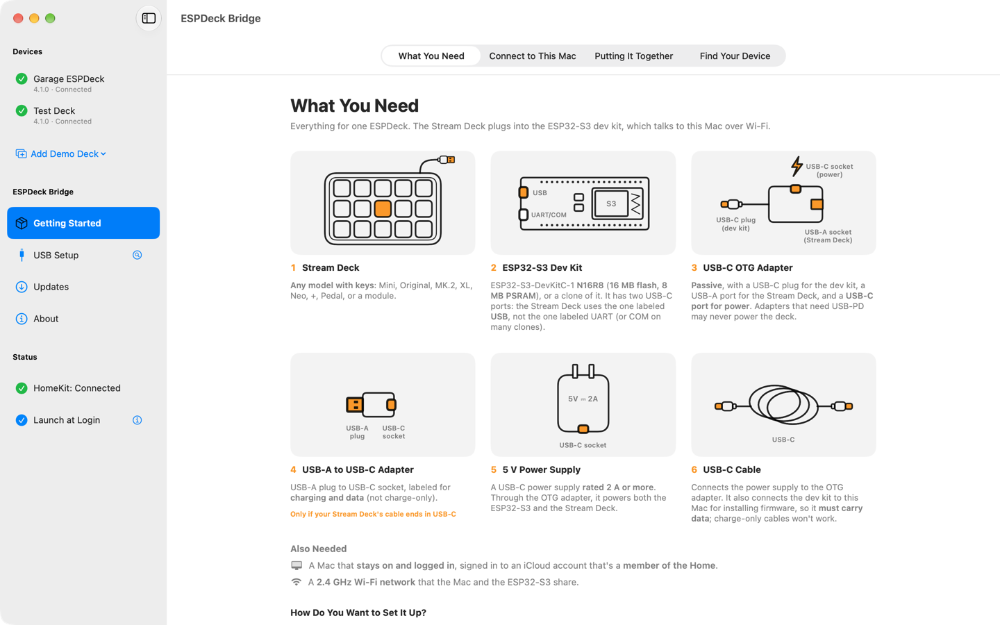

**Getting Started** lists the parts for one ESPDeck under What You Need, then follows the way you choose to set up the dev kit.

- Over USB from the Mac, the steps are Connect to This Mac, USB Setup, Putting It Together, then Find Your Device.
- Over Wi-Fi with the setup codes on the deck, the steps are Putting It Together, Set Up over Wi-Fi, then Find Your Device. Set Up over Wi-Fi shows a deck in setup mode and the steps for a phone or tablet. It also says what to do when the phone leaves the deck's network, or the deck isn't in setup mode.

**Find Your Device** lists the decks on the network that aren't working with this Mac yet: new ones, and ones it knows that are waiting to be paired again or need attention. It also lists boards plugged in over USB that still need setting up.

**USB Setup** installs firmware on a board plugged into the Mac and sets up its Wi-Fi and name; see [Installing](setup.md#installing). The end of the page says what comes next, with a button for Putting It Together.

## Updates

The Updates page keeps the decks' firmware current. It finds releases on GitHub and sends them to the decks over Wi-Fi.

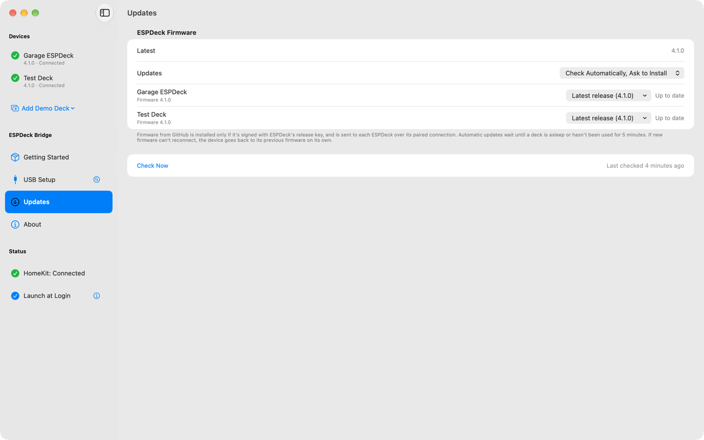

- The page checks GitHub Releases for firmware (tags `firmware-vX.Y.Z`).
- It can be set to **Install Automatically**, to **Check Automatically, Ask to Install**, or to **Check Manually**, which only checks when you click **Check Now**.
- It offers only signed releases (see [Release signing](development.md#release-signing)).
- The repository must be public for update checks to work.
- The app itself is distributed and updated through the Mac App Store.

## Menus and keyboard shortcuts

Every command in the menu bar, with its keyboard shortcut where it has one.

| Menu | Command | Keys | What it does |
|---|---|---|---|
| **ESPDeck Bridge** | Check for Updates… | | Looks for firmware releases. |
| | Launch at Login | | Starts the app when you log in. |
| **File** | New Demo Deck | ⌘N | Adds a demo deck. The submenu lists the models, and ⌘N makes the first. |
| | Find Your Device | ⇧⌘F | Opens Getting Started's list of decks waiting to be set up or paired. |
| | Set Up Device over USB… | ⇧⌘U | Opens USB Setup. |
| | Export Bridge… | | Saves the bridge to a file. See [Moving to another Mac](#moving-to-another-mac). |
| | Import Bridge… | | Loads a bridge from a file. |
| | Reset Bridge… | | Forgets every device and starts over as a new bridge. |
| **Edit** | Undo, Redo | ⌘Z, ⇧⌘Z | Undoes or redoes a change to a key. |
| | Cut, Copy, Paste | ⌘X, ⌘C, ⌘V | Acts on the selected key, or on the text in a text field. Copy also copies selected Log entries. |
| | Clear Key… | Delete | Empties the selected key, after the same confirmation as the button. |
| **View** | Keys, Device, Log | ⌘1, ⌘2, ⌘3 | Shows that page of the selected deck. |
| | Getting Started, USB Setup, Updates, About | | Shows that page of the sidebar. |
| | Zoom In, Zoom Out | ⌘=, ⌘- | Makes the deck preview larger or smaller. |
| | Size to Fit | ⌘0 | Fits the deck preview to its pane. |
| **Device** | Next Device, Previous Device | ⌘], ⌘[ | Steps through the decks in the sidebar. |
| | A device by name | ⌃⌘1 to ⌃⌘9 | Shows that deck. |
| | Sleep Now, Wake Now | | Turns the deck's screen off or on. |
| | Enter Setup Mode, Exit Setup Mode | | Puts the deck in setup mode, or takes it out. |
| | Install Firmware Update | | Installs the latest release on the deck. |
| | Forget Device… | | Removes the deck from this Mac and unpairs it. |
| **Key** | Select Key to the Left, Right, Above, Below | ⌥ and an arrow | Moves the selection. Plain arrows work too, after a click in the deck preview. |
| | Test Action | ⌘T | Performs the selected key's action now. |
| | Assign Home…, Shortcut…, Page… | ⌥⌘1, ⌥⌘2, ⌥⌘3 | Opens the key's picker on that tab. |
| **Help** | ESPDeck Help | | Opens this documentation. |
| | Getting Started | | Opens one of Getting Started's sheets, from a submenu. |

## Moving to another Mac

A deck only talks to the bridge it's paired with: the bridge's ID and the deck's pairing key. ESPDeck Bridge can move both to another Mac, with everything else, so the decks connect there without pairing again.
1. On the old Mac, choose **File ▸ Export Bridge…** (or **Export Bridge…** on the About page). Enter a passphrase twice (at least 10 characters; a few random words work well) and save the file, `ESPDeck Bridge.espdeckbridge`. It holds the bridge ID, every device's pairing key, the settings (devices, key layouts, sleep/wake triggers and commands), the icons and shortcut icons, and the developer password, with the app version, the date and the Mac's name.
2. On the new Mac, choose **File ▸ Import Bridge…** (also on the About page, and in the empty window before any device is set up). Choose the file and enter the passphrase. The app shows what's in it (how many devices and their names, when and on which Mac it was exported). If this Mac already has devices or pairings, importing replaces them, and it asks first. The new identity takes effect at once: the app drops its connections and advertises the imported bridge, and the decks reconnect to it within a few seconds. No relaunch is needed.
3. Only one Mac can be the bridge at a time. Quit ESPDeck Bridge on the old Mac or remove the bridge there, or the decks switch between them. **Also remove this bridge from this Mac after exporting** (off by default) does that for you: once the file is saved, the old Mac deletes the pairing keys, settings, icons and developer password, and starts over as a new bridge with no devices. It doesn't tell the decks anything; they stay paired with the bridge in the file.

The file is encrypted with AES-256-GCM, under a key derived from the passphrase with PBKDF2-HMAC-SHA256 (calibrated to take about 0.75 s on the exporting Mac, and at least a million rounds), and its header is authenticated too, so a wrong passphrase or a changed file is refused before anything on the Mac changes. Still, the file and its passphrase together are as sensitive as the decks themselves: anyone with both can control them. Keep it somewhere private and delete it once you've imported it; a forgotten passphrase can't be recovered. Decks whose stored secrets are encrypted aren't affected: their keys stay on the chip, and only the Mac side moves.

## Sandbox and security

The Mac app runs in the App Sandbox (`Support/ESPDeck Bridge Catalyst.entitlements`), with: network client and server (the WebSocket server on port 48620, Bonjour `_deckbridge._tcp`, GitHub downloads), HomeKit, USB serial ports (`com.apple.security.device.serial`, for USB Setup), read and write access to files you pick (Install Firmware from File…, Save as ota_password.txt…), and Apple Events to Shortcuts Events (`com.apple.security.scripting-targets` for `com.apple.shortcuts.events`, access group `com.apple.shortcuts.run`, plus the hardened runtime's `com.apple.security.automation.apple-events`). Pairing keys stay in the Keychain, and Launch at Login uses `SMAppService`, both of which work sandboxed. It's also built with Xcode's Enhanced Security: pointer authentication, the hardened-process entitlements, and hardware memory tagging in soft mode (`xcode-security-settings.md` in the `ESPDeck Bridge` folder records the settings).

## Moving from an unsandboxed build

Earlier builds kept their data in `~/Library/Application Support/ESPDeck Bridge`, which the sandboxed app can't read. To keep your key layouts and icons: quit ESPDeck Bridge, then in Finder move that `ESPDeck Bridge` folder into `~/Library/Containers/com.tmproductions.ESPDeck-Bridge/Data/Library/Application Support/` (the container exists once the sandboxed app has run; replace the `ESPDeck Bridge` folder it made), and open the app again. Pairings are in the Keychain and carry over.

## How it's built

The app is a Mac Catalyst target (Mac only) with a small macOS bundle target, `ESPDeckMenuBar`, embedded in `Contents/PlugIns`. That bundle owns the `NSStatusItem` (which Catalyst can't create), sends the Apple Events for Shortcuts (which Catalyst can't either), and does USB Setup's serial work: the port list (IOKit), the ROM bootloader protocol (`ESPLoader`), and Improv. `Shared/DeckMenuBarProtocols.swift` is compiled into both targets.
