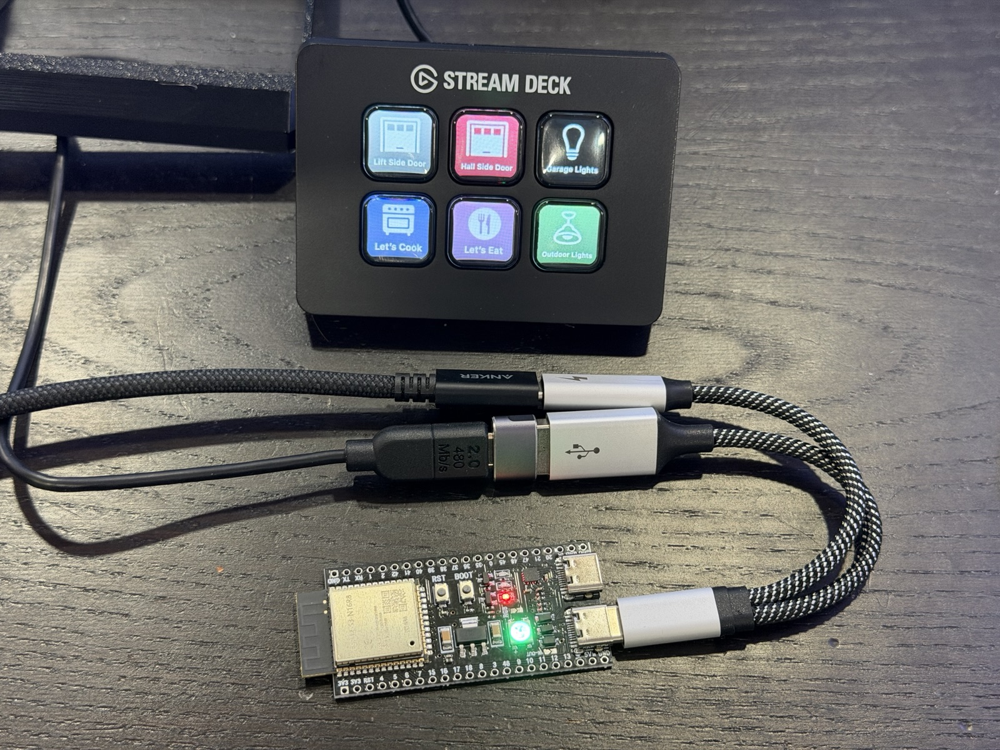
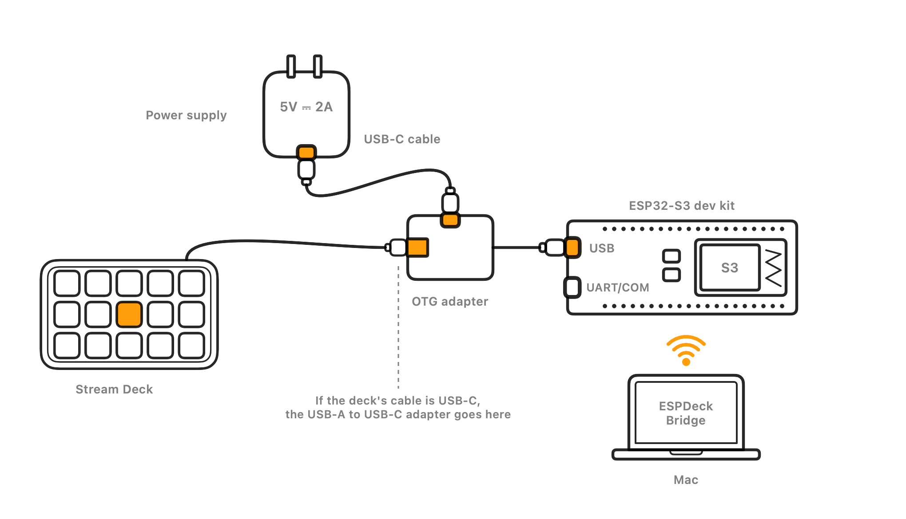
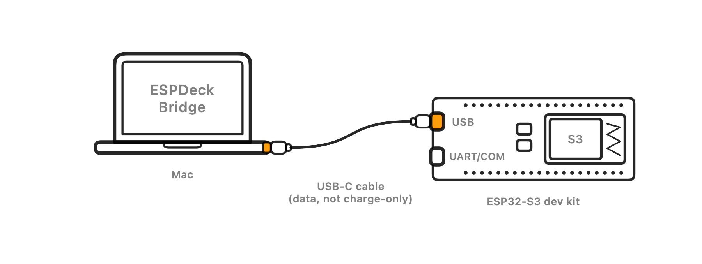
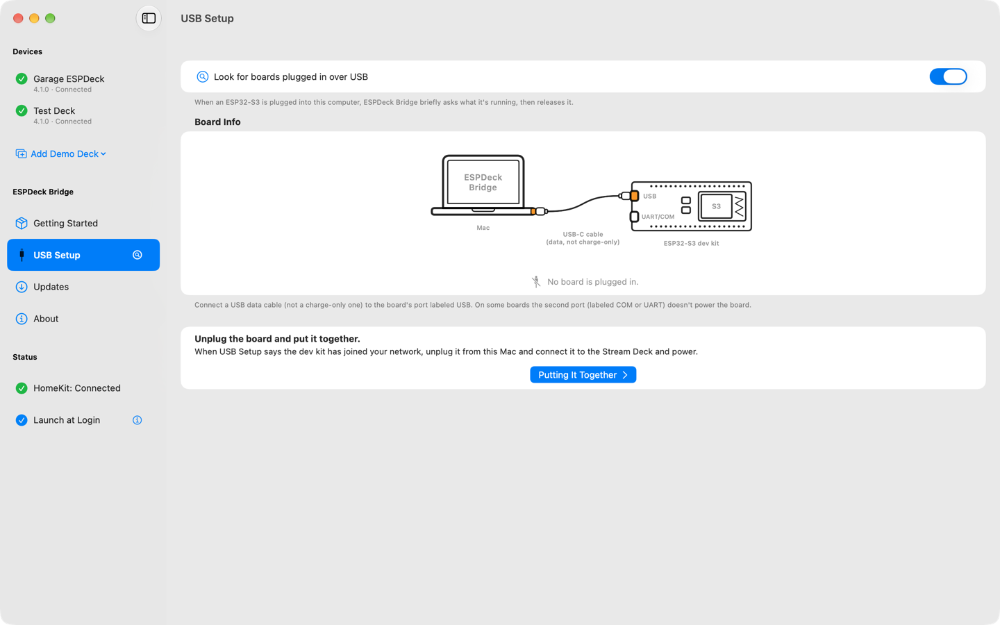
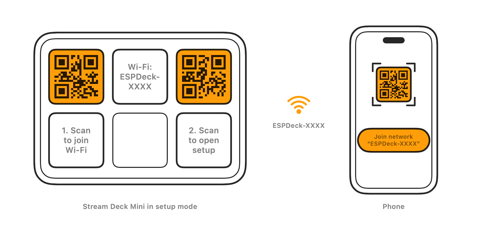

# Setting up a deck

[Overview](../README.md) · [Setting up a deck](setup.md) · [The Mac app](mac-app.md) · [FAQ](faq.md) · [Development](development.md)

 A deck put together: the dev kit's USB port goes to the OTG adapter, which takes the power cable and, through a USB-A adapter, the Stream Deck's own cable.

 How the parts connect once the dev kit is set up.

1. Install the firmware (below): from ESPDeck Bridge's **USB Setup** page, with the web installer, or with `pio run -t upload`.
2. Plug in a Stream Deck. Every model with keys works (Mini, Original, MK.2, XL, Neo, +, Pedal, and the modules); the firmware reports its layout and image format to the Mac.
3. Set up Wi-Fi in setup mode (below). There's nothing to configure at build time.

## Installing

### The board's two USB ports

The ESP32-S3 dev kit has two USB-C ports:
- **USB**: the chip's own USB. ESPDeck uses it for the Stream Deck (through the OTG adapter), and it's also the easiest port to install through.
- **UART**, or **COM** on many clone boards (the "YD-ESP32-S3" style of N16R8 board is common): a USB-to-serial chip, for logs.

### Clone boards

On some clones, the COM port doesn't power the board. Use the USB port for setup in any case: ESPDeck Bridge's USB Setup works there. Otherwise they work the same as Espressif's board.

### Steps

 For setup, the dev kit's USB port goes to the Mac with a cable that carries data.

1. Connect the board's **USB** port to the computer with a data cable.
2. **Put the board in flashing mode** if it's running other firmware; a new board's demo firmware usually is. Hold **BOOT** (also labeled B0 or IO0), press and release **RST** (also labeled EN or RESET), then release BOOT. A new serial port appears (`/dev/cu.usbmodem…` on a Mac).
3. Install with ESPDeck Bridge (see [Installing with ESPDeck Bridge](#installing-with-espdeck-bridge)), the web installer, or `pio run -t upload --upload-port /dev/cu.usbmodem…`.
4. If the board doesn't start ESPDeck afterward (its serial port is still there), press **RST** or unplug and replug it.
5. With ESPDeck Bridge or the web installer, stay there: once ESPDeck starts, you can **connect it to Wi-Fi** over the same cable (with the [Improv](https://www.improv-wifi.com/serial/) protocol). Pick your network and enter its password. If you skip this, set up Wi-Fi later with the QR codes on the deck (setup mode, below).

### Installing with ESPDeck Bridge

Open **USB Setup** in the configuration window's sidebar, or choose **Set Up a Device over USB…** in the menu bar menu.

#### Finding the board

- With **Look for boards plugged in over USB** on (the default; turn it off if you use this Mac for other ESP32 work), the page lists the boards plugged in, and the sidebar entry shows how many. With several boards, click the one to set up.
- When an ESP32 appears on its own USB port, the app opens that port once and asks what it's running (Improv device information), which Wi-Fi network it's set up for (firmware 4.1.0 and later; the name only, never the password) and whether its stored secrets are encrypted. Then it closes the port again. Opening it doesn't restart the board.
- A board on a USB serial chip (a COM or UART port) is asked only when you click **Check**, since opening such a port can restart the board.
- Setup itself is done on the board's **USB** port. On a COM port the page only shows the board, with a note to move the cable; the steps (installing firmware, Wi-Fi, the name) appear once it's on the USB port.

#### What Board Info shows for an ESPDeck board

- Its version against the latest release: up to date, an update available, or newer (a development build).
- Its Wi-Fi network: "Wi-Fi: <name>", marked "not connected" when it isn't on it, or "No Wi-Fi set up".
- Whether its stored secrets are encrypted: "Stored secrets: encrypted" or "not encrypted".

#### 1. Install Firmware

- Choose the firmware in the Firmware menu: the latest release from GitHub (checked against its SHA-256 and signature), or a file from **Choose File…** at the end of the menu. The refresh button next to it looks for new releases.
- Click **Install Firmware**. Installing an older version than the board runs asks first.
- The app puts the board into flashing mode itself: through the reset lines of the USB-Serial/JTAG port, or, for firmware with its own USB serial port, the 1200 bps signal that Arduino sketches honor. Other firmware (ESP-IDF's USB examples, say) ignores that, and then the page asks you to hold BOOT and press RST. The board comes back as a new port in the same USB socket, which the page follows.
- Before writing anything, in the bootloader, it checks the chip (ESP32-S3), the flash size (the flash chip's JEDEC ID, against what the image's partition table needs: 16 MB) and the built-in PSRAM (from the eFuses: 8 or 16 MB of octal PSRAM, without which the firmware stops at startup). It shows what it found, like "ESP32-S3, 16 MB flash, 8 MB PSRAM".
- It writes the bootloader, partition table and app, but not the data partitions, so a reinstall keeps the Wi-Fi settings, name and pairing. (The web installer erases everything.)
- After the board restarts, the page asks it again what it runs.

#### 2. Set Up Wi-Fi, and the name

- The page looks for Wi-Fi networks the first time it shows an ESPDeck board; the refresh button next to the Network menu looks again.
- The Network menu starts on the network the board is already set up for (listed as the current setting when the board can't see it); otherwise on **Choose…**, and **Join Network** waits until you pick one or type one under **Other Network…**.
- A new board has **Encrypt stored secrets (recommended)** checked; see [Encrypting stored secrets](#encrypting-stored-secrets).
- Looking for networks, **Join Network** and **Rename** each open the port for that one action.

#### Afterward

- Once on Wi-Fi the board finds the bridge by itself, and appears under **New Devices** for pairing, which needs the Stream Deck attached to hold Confirm.
- The page recognizes it there by its ID (the MAC address, which is the USB serial number of the ESP32-S3's own USB port), so a board renamed after it first connected is still found.
- The end of the page says what comes next: unplugging the board and putting the deck together.

The app writes the flash through the ESP32-S3's ROM bootloader protocol itself (no esptool), so it works in the App Sandbox with only the `com.apple.security.device.serial` entitlement.

### Computer or Stream Deck

At startup ESPDeck looks at its USB port for about 1.5 seconds. If a computer is on the other end, the port stays a serial port: it shows up on the computer, logs appear there, Improv works, and reinstalling needs no BOOT/RST. Wi-Fi, setup mode and the bridge connection work as usual, but there's no Stream Deck. Only when there's no computer, as with the OTG adapter and a Stream Deck, does the port become the deck's USB host. The decision is made once per boot, so after switching cables, press **RST** or power-cycle the board.

### After installing

Updates normally come over Wi-Fi from ESPDeck Bridge (see [Firmware updates and releases](development.md#firmware-updates-and-releases)). For logs while a deck is attached, connect the UART/COM port to the computer at 115200 baud (`pio device monitor`); it also accepts Improv and uploads with automatic reset.

## Setup mode

 Setup mode: scan the first code to join the deck's network, and the second to open its setup page.

The device starts in setup mode when it has no Wi-Fi credentials. To enter it later, hold the top-left and bottom-right keys for 5 seconds, or turn it on from the Mac. After 2 seconds of holding, the other keys go dark and the middle column counts down (3, 2, 1) under "Entering Setup In"; letting go of either key cancels and the keys go back to normal. The deck then shows:
- top-left: a QR code that joins the device's access point, `ESPDeck-XXXX` (last four hex digits of its MAC address), with "1. Scan to join Wi-Fi" on the key below;
- top-right: a QR code for the setup page, `http://192.168.4.1/`, with "2. Scan to open setup" below;
- top center: the network's name, `ESPDeck-XXXX`;
- bottom center: **Exit setup**, once the device has credentials that work.

### Joining its network

1. Scan the left QR code with your phone's camera and join the network it offers.
2. If the phone doesn't stay connected (it may drop back to your usual Wi-Fi, because this network has no internet), open the phone's Wi-Fi settings and choose the name shown on the top-center key. Scanning the QR code already saved its password.
3. Joining from Settings usually opens the setup page by itself. If it doesn't, scan the right QR code.

The access point (WPA2/WPA3) gets a new random password each time setup mode starts, and the QR code carries it, so scan the QR code again each time. The setup page only answers phones joined to the deck's own network. On the page, set the device name and pick a Wi-Fi network (2.4 GHz only). The network is saved only once the device has joined it (within 30 seconds); if it can't, the page says why and the previous network stays. After it joins, the page shows its new address, and the device leaves setup mode 8 seconds later. With a working network, setup mode also ends after 15 minutes with no phone connected. Settings live in NVS, so reflashing keeps them. The setup page also shows which bridge the device is paired with, and can unpair it.

## Pairing

A device only obeys the bridge it's paired with. When an unpaired device connects, the deck reads "Pair in / ESPDeck / Bridge". Click **Pair with This Mac** (available once a Stream Deck is plugged into the dev kit, since confirming needs its keys): the deck shows `Pair?` and a 6-digit code in its top row, with **Cancel** and **Hold to Confirm** in the bottom row, and the Mac shows the same code. If they match, click **The Deck Shows This Code** on the Mac and hold Confirm on the deck for 1.5 seconds, in either order. The Pedal has no display: its status LED blinks magenta, and holding any pedal confirms. A pairing that isn't confirmed within 2 minutes is canceled.

A paired device refuses pairing and only connects to its own bridge. To move it to another Mac, first **Forget** it on the Mac it's paired with, or use **Unpair** on the deck's setup page. A deck that's paired with another Mac, or whose pairing key this Mac no longer has, shows a page that says so, with **Unpair Over USB** (for the board plugged into this Mac) and the steps to unpair on the deck's setup page. To move every deck to a new Mac at once, without pairing again, move the bridge instead (see [Moving to another Mac](mac-app.md#moving-to-another-mac)). Pairing needs firmware 4.0.0 or later; a device on older firmware shows under New Devices as needing an update over USB.

Renaming a device over USB or on its setup page updates its name under New Devices right away (firmware 4.1.0 and later).

## The status light

The dev kit has a small colored light that shows what the deck is doing. It's the quickest way to tell where a deck has got to when its keys are dark, and it's the only display a Stream Deck Pedal has.

| | Light | What it means |
|---|---|---|
|  | **Pulsing blue** | The deck is in setup mode. |
|  | **Pulsing yellow** | The dev kit is looking for its Wi-Fi network. |
|  | **Pulsing green** | The dev kit is on Wi-Fi and looking for ESPDeck Bridge, or waiting on it (to be unpaired, say). |
|  | **Green** | The deck is connected to ESPDeck Bridge. The light is brighter while data moves. |
|  | **White** | A key is pressed. |
|  | **Blinking magenta** | A pairing is waiting. The light turns steady once the code is confirmed on the deck. |

While the deck is asleep, green is off and the other colors are very dim. ESPDeck Bridge shows the same list on each deck's Device page, under Status Light.

## Encrypting stored secrets

The dev kit keeps its Wi-Fi password, pairing key and developer password in its flash, where anyone who takes it can read them over USB. Firmware 4.1.0 and later can encrypt them with a key burned into the ESP32-S3's eFuses that no software can read (ESP-IDF's HMAC-based NVS encryption; no flash encryption needed).

**New devices are encrypted by default, at first setup.** When a new dev kit (nothing saved yet: no Wi-Fi network, not paired; also one after a factory reset) joins its first Wi-Fi network, it burns its key and encrypts its storage just before saving that network, so the password is never stored unencrypted. It takes under a second and needs nothing else from you; the key is only burned once the network has actually worked. If the chip can't do it, setup carries on unencrypted and the log says why.

**Opting out (Standard storage).** To keep plain flash on a new device, uncheck **Encrypt stored secrets (recommended)** before joining:
- in ESPDeck Bridge's **USB Setup**, step **2. Set Up Wi-Fi** (shown for boards on firmware 4.1.0 or later that aren't set up yet), or
- on the setup page (setup mode), next to the Wi-Fi settings.

The device remembers that choice (until a factory reset), so it doesn't ask again. Board Info in USB Setup and the device's **Device** page (under **Security**) show which way it stores its secrets. The web installer's Wi-Fi step always uses the default, encrypted.

**Devices set up before, or set up as Standard,** keep their settings unencrypted until you choose otherwise: their **Device** page, under **Security**, recommends encrypting and has **Encrypt Stored Secrets Now…**, which moves every setting across (Wi-Fi, name, pairing: nothing needs setting up again) and restarts the deck. Keep it powered for the few seconds that takes; a power cut in the middle can reset its settings, and it then starts in setup mode. ESPDeck Bridge never does this by itself.

Either way it's one-way: the eFuse key is permanent, so that dev kit always encrypts what it stores. Only the encryption is permanent, not the settings: the Wi-Fi network, name and pairing can still be changed as usual. The deck works as before, updates still work, and a factory reset or the web installer start over with empty storage that's still encrypted.

Firmware older than 4.1.0 can't read encrypted storage. ESPDeck Bridge won't install it on an encrypted device, over Wi-Fi or from a file. Installed anyway over USB or with PlatformIO, it erases the settings and starts over unencrypted; installing 4.1.0 or later again encrypts them again.
